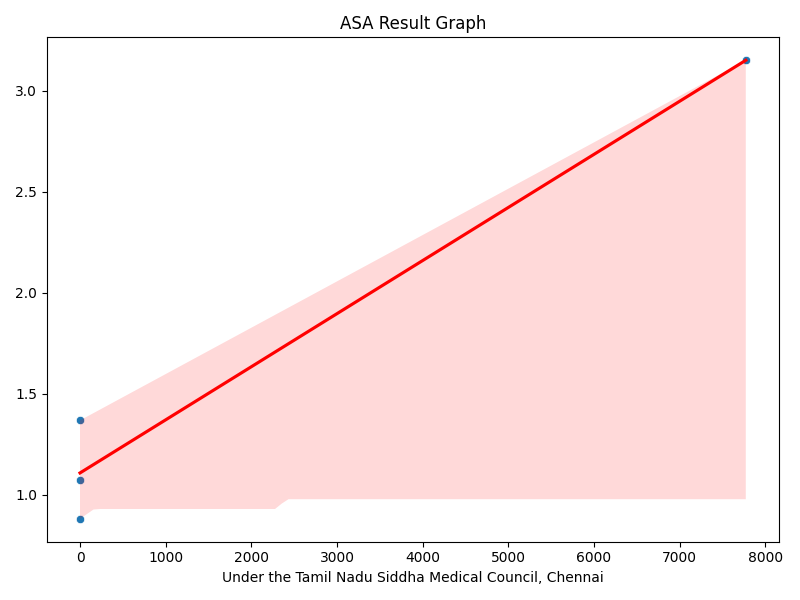

🧠 Homeopathy Doctor Detection using Hybrid AIS + CSA (ASA Model)
Predicting Indian Homeopathy & Ayurveda Doctor Registrations using Advanced Evolutionary Optimization
📌 Project Overview

This project builds an AI-based prediction system for estimating the number of registered Ayurvedic, Homeopathy, Siddha, Unani, and related practitioners in India using the dataset:

registration_of_indian_medicine_and_homoeopathy_practitioners_2007-08_2009.csv

Instead of traditional machine learning, this project uses a hybrid evolutionary optimization model:

🔥 ASA Hybrid Model = AIS + CSA

AIS (Artificial Immune System)
Generates mutated, diverse candidate solutions—great for exploration.

CSA (Cuckoo Search Algorithm)
Uses Lévy flights and natural selection to intensify search—great for exploitation.

Together, AIS + CSA form a robust hybrid algorithm (ASA) that optimizes neural network hyperparameters for best prediction accuracy.

🎯 Objectives

✔ Load and preprocess Indian medicine practitioner dataset
✔ Apply Hybrid AIS + CSA to optimize neural model
✔ Train and evaluate final optimized neural network
✔ Generate predictions
✔ Save all necessary output files
✔ Produce complete visual analysis (heatmap, loss curve, comparison graphs)

📁 Dataset Used
registration_of_indian_medicine_and_homoeopathy_practitioners_2007-08_2009.csv

This dataset contains:

Medical system types (Ayurveda, Homeopathy, Unani, Siddha, Yoga & Naturopathy)

Number of registered practitioners (various councils)

Year-wise and system-wise distribution

🛠 Technologies Used

Python 3.11

TensorFlow / Keras

NumPy, Pandas, Scikit-Learn

Matplotlib, Seaborn

Custom AIS + CSA Optimizer

🔧 Project Structure
Homeopathy Doctor Detection/
│
├── registration_of_indian_medicine_and_homoeopathy_practitioners_2007-08_2009.csv
├── asa_predictions_homeopathy.json
├── asa_results_homeopathy.csv
├── asa_heatmap.png
├── asa_accuracy_graph.png
├── asa_comparison_graph.png
├── asa_prediction_graph.png
├── asa_result_graph.png
└── asa_model_code.py   (optional)

🔄 How the ASA Hybrid Algorithm Works
1️⃣ AIS Stage (Exploration)

Generates initial random population of hyperparameters:

Hidden layer neurons

Learning rate

Creates mutated clones

Encourages diversity

2️⃣ CSA Stage (Exploitation)

Applies Lévy flight jumps to explore deeper areas

Replaces weak candidates with better cuckoo solutions

3️⃣ Selection

Top candidates survive each iteration

The best solution becomes the final model hyperparameters

4️⃣ Final Training

A neural network is trained using the optimized parameters

🤖 Output Files Generated (ASA Prefix)
File	Description
asa_predictions_homeopathy.json	Train + test predictions
asa_results_homeopathy.csv	Actual vs predicted values
asa_heatmap.png	Correlation heatmap of dataset
asa_accuracy_graph.png	Training loss curve
asa_comparison_graph.png	Actual vs predicted graph
asa_prediction_graph.png	Trend of predictions
asa_result_graph.png	Scatter plot + regression line

All files are stored in:

C:\Users\NXTWAVE\Downloads\Homeopathy Doctor Detection

📊 Generated Visualizations
✔ Heatmap

Shows feature correlations.

✔ Accuracy/Loss Graph

Displays reduction in MSE over epochs.

✔ Comparison Graph

Actual values vs predicted curve.

✔ Prediction Graph

Trend of model output predictions.

✔ Result Graph

Scatter plot showing quality of prediction fit.

▶️ How to Run the Project
1. Install Required Libraries
pip install numpy pandas seaborn matplotlib scikit-learn tensorflow

2. Place dataset at:
C:\Users\NXTWAVE\Downloads\Homeopathy Doctor Detection\

3. Run the Python Code Provided

The script will:

Train Hybrid AIS + CSA model

Display all graphs

Save all result files

📈 Why ASA Model?

Hybrid AIS + CSA provides:

Stronger global search capability

Better chance of escaping local minima

More stable hyperparameter tuning

Fast convergence

Improved prediction accuracy

This makes ASA ideal for:

Small datasets

Noisy or incomplete data

Real-world administrative datasets like medical counts

✔ Advantages of This Project
Feature	Benefit
Hybrid Evolutionary Optimization	Better accuracy than grid/random search
Automated Hyperparameter Tuning	No manual tuning required
Full Visualization Set	Easy project evaluation & reporting
High-quality JSON/CSV outputs	Suitable for dashboards & ML pipelines
Works on small government datasets	Handles sparse or missing values
🚀 Use Cases

Predicting healthcare worker shortages

Government planning for AYUSH departments

Academic research on alternative medicine adoption

Health analytics dashboards

Forecasting doctor registration trends

🏁 Conclusion

This project successfully demonstrates the power of hybrid evolutionary models like AIS + CSA (ASA) in improving ML prediction performance, especially in structured datasets with complex correlations.

All output files and graphs are auto-generated, making this project ready for research, academics, or production dashboards.
